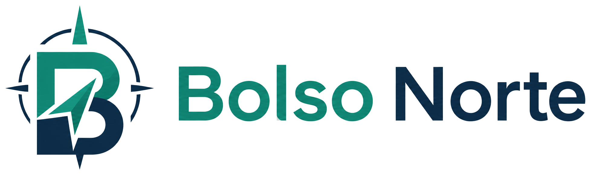

# Bolso Norte

Aplicacao web responsiva para organizacao financeira pessoal, com painel mensal, entradas, gastos, contas, metas, reserva de emergencia e investimentos.

## Status

Versao beta em preparacao para teste publico.

Esta versao beta e disponibilizada gratuitamente para testes. Recursos, limites, disponibilidade e formas de acesso poderao ser alterados futuramente, incluindo a criacao de planos pagos. Nenhum preco esta anunciado nesta etapa.

## Acesse

[Abrir o Bolso Norte](https://bolsonorte.com.br/)

Dominio oficial: `https://bolsonorte.com.br`.

## Demonstracao


## Funcionalidades

- Cadastro e login com e-mail e senha.
- Primeiro acesso com configuracao inicial do perfil financeiro.
- Navegacao por mes e ano.
- Entradas, salario planejado e confirmacao de recebimento.
- Gastos por categoria e forma de pagamento.
- Controle de contas, pagamento e recorrencia mensal.
- Meta principal e reserva de emergencia.
- Aportes em reservas e investimentos.
- Painel com indicadores, graficos e versao responsiva para mobile.

## Tecnologias

- React
- TypeScript
- Vite
- Supabase Auth
- Supabase Database
- Recharts
- Lucide React
- CSS tradicional

## Desenvolvimento local

1. Instale as dependencias:

```bash
npm install
```

2. Crie um arquivo `.env` a partir do `.env.example` e informe as variaveis publicas do projeto Supabase.

3. Execute o ambiente local:

```bash
npm run dev
```

4. Gere uma build de producao:

```bash
npm run build
```

## Seguranca e privacidade

- Autenticacao gerenciada pelo Supabase.
- Dados isolados por usuario com politicas RLS no banco.
- Sessao persistida pelo cliente Supabase.
- Em producao, a aplicacao deve ser acessada por HTTPS.

Nunca informe senhas bancarias, codigos de acesso ou credenciais de instituicoes financeiras dentro da aplicacao.

## Possiveis evolucoes

Os itens abaixo sao possibilidades futuras e nao representam promessa de prazo ou disponibilidade:

- Recuperacao de senha.
- Login com Google.
- Alteracao de e-mail e senha.
- Exclusao da conta.
- Politica de privacidade e termos de uso completos.
- Planos gratuito e premium.
- Assinatura mensal ou anual.
- Relatorios avancados.
- Exportacao de dados.
- Notificacoes.
- Multiplas metas.
- Monitoramento e suporte.

## Licenca

Codigo proprietario. Este projeto nao e open source.

Todos os direitos reservados. O codigo e publicado somente para visualizacao, demonstracao tecnica e portfolio. Usar o site oficialmente hospedado nao concede permissao para copiar, modificar, redistribuir, hospedar, implantar ou criar trabalhos derivados deste codigo.

Consulte o arquivo [LICENSE](./LICENSE).
